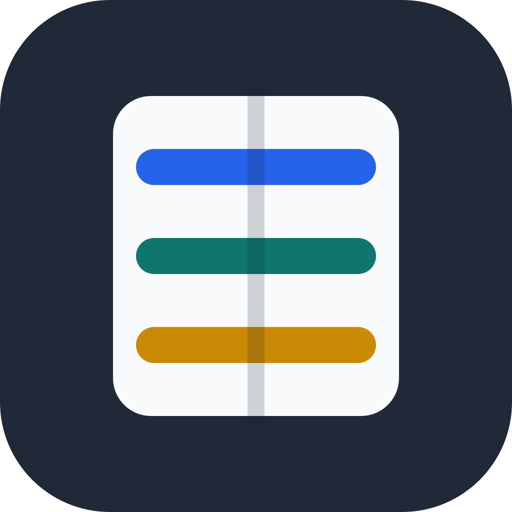

# ZipForge

ZipForge is an early macOS archive utility written in Swift. The first version focuses on a usable local workflow: open a zip archive, inspect entries, extract to a chosen folder, and create a new zip from files or folders.

## Current scope

- SwiftUI macOS interface
- Drag and drop archive selection
- Drag and drop compression queue for files and folders
- Compression settings panel with speed presets, compression level, filename encoding choice, and traditional ZIP password protection
- Zip inspection through `/usr/bin/zipinfo`
- Zip extraction through `/usr/bin/ditto`
- Zip creation through `/usr/bin/zip`
- Friendly unsupported-format handling for `.7z`, `.rar`, `.tar`, `.gz`, and unknown files

## Build and test

```sh
swift test
swift run ZipForge
```

## Package a local app

```sh
Scripts/package_app.sh
Scripts/package_dmg.sh
```

The packaging scripts create `dist/ZipForge.app` and `dist/ZipForge.dmg`. This first productized build uses ad-hoc signing for local sharing and testing; it is not notarized for public distribution.

## Product notes



The first compression settings implementation maps speed presets to standard ZIP compression levels and passes the selected level to `/usr/bin/zip`. Password protection uses traditional ZIP encryption through the system zip tool, not AES. Filename encoding is exposed in the product UI for workflow clarity, but the first engine still follows the system zip tool's filename handling.

`swift test` and full SwiftPM builds require a complete Xcode installation because XCTest must be available. With Command Line Tools only, core source syntax can still be checked with `swiftc -parse Sources/ZipForgeCore/*.swift`.

The initial build is designed for local development and direct execution, not App Store distribution. Later versions can add libarchive/7z support, password handling, Finder integration, app signing, and a packaged `.app` release.
